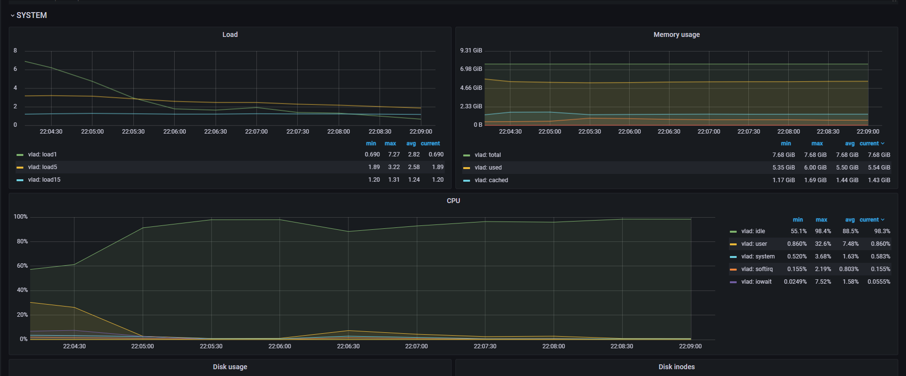
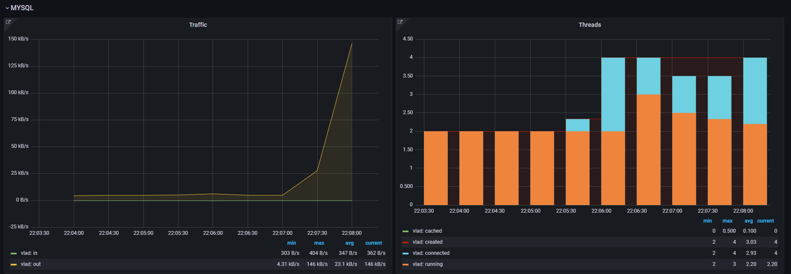
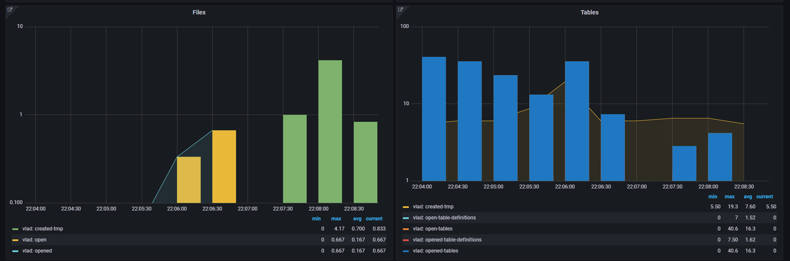
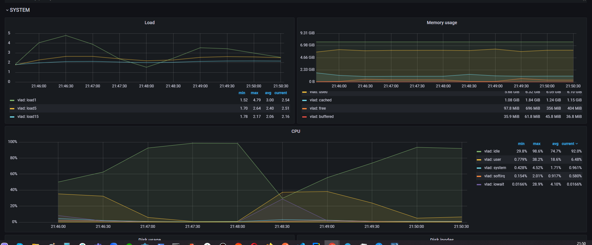
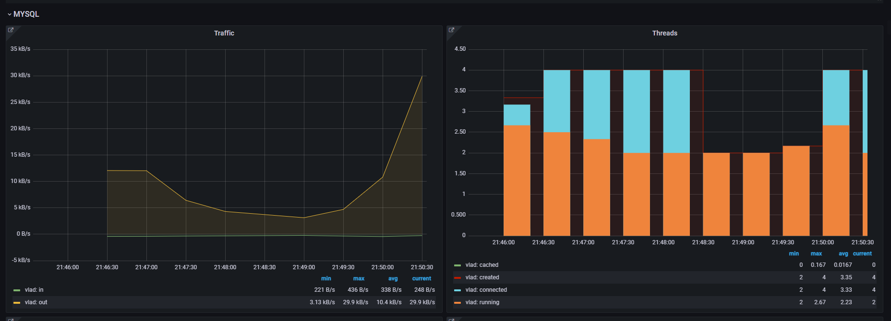
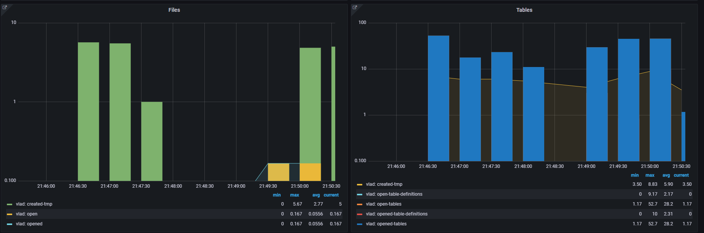
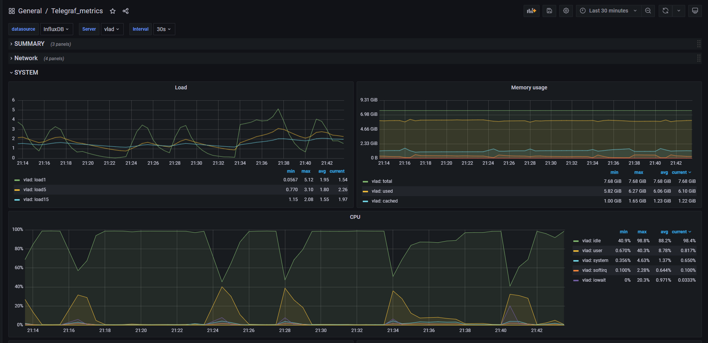
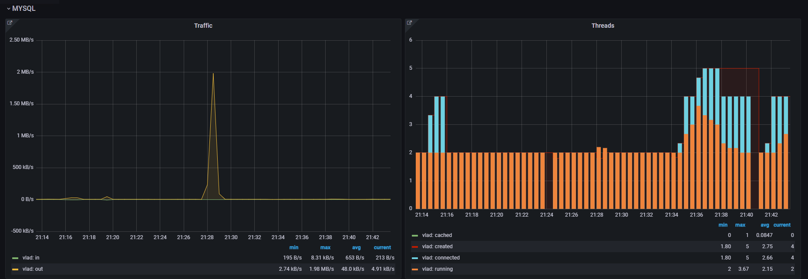
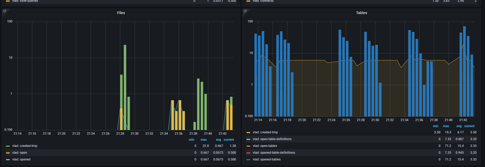

# Mysql Slow Query Log

## Set up MySQL with slow query log.

```docker
  mysql:
    image: mysql:8.0
    container_name: mysql
    environment:
      MYSQL_ROOT_PASSWORD: rootpassword
      MYSQL_DATABASE: slow_query_db
      MYSQL_USER: user
      MYSQL_PASSWORD: password
    volumes:
      - ./mysql/data:/var/lib/mysql
      - ./mysql/config:/etc/mysql/conf.d
      - ./mysql/logs:/var/log/mysql
      - ./mysql/init.sql:/docker-entrypoint-initdb.d/init.sql
    ports:
      - "3306:3306"
    healthcheck:
      test: ["CMD-SHELL", "mysqladmin ping -h localhost"]
      interval: 10s
      retries: 5
      start_period: 30s
      timeout: 5s
```

## Configure ELK to work with mysql slow query log.

```docker
  elasticsearch:
    image: docker.elastic.co/elasticsearch/elasticsearch:8.0.0
    environment:
      - discovery.type=single-node
    ports:
      - "9200:9200"
    volumes:
      - ./elasticsearch/data:/usr/share/elasticsearch/data

  logstash:
    image: docker.elastic.co/logstash/logstash:8.0.0
    volumes:
      - ./logstash/config:/usr/share/logstash/pipeline
    command: bash -c "logstash-plugin install logstash-output-gelf && logstash"
    ports:
      - "5044:5044"
    depends_on:
      - elasticsearch

  kibana:
    image: docker.elastic.co/kibana/kibana:8.0.0
    ports:
      - "5601:5601"
    depends_on:
      - elasticsearch
```

## Configure GrayLog2 to work with mysql slow query log.

```docker
  graylog:
    image: graylog/graylog:4.3
    environment:
      GRAYLOG_HTTP_EXTERNAL_URI: "http://localhost:9000/"
      GRAYLOG_ROOT_PASSWORD_SHA2: "your_sha_password"
      GRAYLOG_PASSWORD_SECRET: "your_random_password_secret"
    ports:
      - "9000:9000"
      - "12201:12201/udp"
    depends_on:
      - mongodb
      - elasticsearch
```

## Set different thresholds for long_query_time (0, 1, 10) and compare performance.

### long_query_time = 0
  




### long_query_time = 1





### long_query_time = 10





